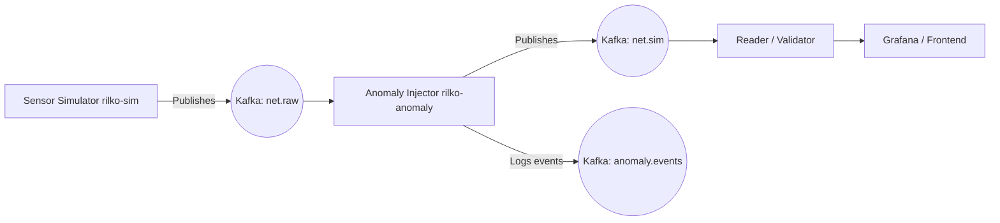

# 🧠 RILKOSAN Realtime Anomaly Detection Prototype

This repository contains a **realtime simulation and anomaly-injection system** built on top of **Apache Kafka**.  
It forms part of the **RILKOSAN project**, designed to enable realtime monitoring, anomaly generation, and analysis of industrial network data streams (e.g., EtherCAT).

---

## 🔧 IMPLEMENTATION PROMPT  
### RILKOSAN Realtime Simulation & Live Anomaly Injection

---

### 0️⃣ Context & Goal

A **Kafka-based pipeline (KRaft mode, no ZooKeeper)** has been successfully deployed locally with **Prometheus** and **Grafana** integration.  
Initial smoke tests using simple producer/consumer scripts (topic `numbers`) are operational.

The next step was to build a **realtime-capable Python simulation and anomaly injector**, which:

- Cyclically sends network/sensor frames (e.g., every **20 ms**, configurable) into Kafka  
- Can toggle live anomalies via a **control topic** without restart  
- Logs **labels and anomaly events**  
- Works natively on **Windows + Docker Desktop**  
- Maintains compatibility with existing Kafka setup  

🎯 **Goal:** Modular, fault-tolerant, PEP8-compliant Python code — with minimal tests, Docker integration, and documentation.

---

### 1️⃣ Technologies & Libraries

| Component | Description |
|------------|-------------|
| **Python** | 3.10 + |
| **Kafka Client** | `confluent-kafka` (used throughout for consistency) |
| **Data Handling** | `pandas`, `numpy` |
| **Monitoring (optional)** | `prometheus_client` → HTTP endpoint `/metrics` |
| **Logging** | Structured logging via Python `logging` module |

---

### 2️⃣ Kafka Topics & Data Model

#### Topics

| Topic | Description |
|--------|-------------|
| `net.raw` | Baseline frames as received (optional mirroring) |
| `net.sim` | Frames after anomaly injection |
| `control.anomaly.commands` | Control messages for activating anomalies |
| `anomaly.events` | Event logs per anomaly occurrence |

#### JSON Schema (per frame)
```json
{
  "timestamp_s": 0.00,
  "seq_number": 1234,
  "frame_time_delta_ms": 20.28,
  "jitter_ms": 0.28,
  "rtt_ms": 0.39,
  "eth_src": "00:1A:11:01:00:10",
  "eth_dst": "00:1A:11:01:00:20",
  "eth_type": "0x0800",
  "ip_src": "192.168.1.10",
  "ip_dst": "192.168.1.100",
  "ip_ttl": 61,
  "ip_len": 151,
  "ip_checksum_ok": true,
  "udp_srcport": 12002,
  "udp_dstport": 12001,
  "udp_len": 131,
  "udp_checksum_ok": true,
  "fcs_ok": true,
  "frame_length": 638,
  "bytes_per_second": 31456.77,
  "anomaly_flag": false,
  "anomaly_type": "",
  "anomaly_id": "",
  "flow_id": "00:1A:11:01:00:10>00:1A:11:01:00:20|12002>12001"
}
```

## 3️⃣ Supported Anomalies

### ✅ Currently Implemented

| Type               | Effect                                                        |
| ------------------- | ------------------------------------------------------------- |
| `payload_corruption` | Randomly modifies numeric sensor values (`distance_mm ± [100–500]`) |
| `late_packet`        | Adds transmission delay (`100–300 ms`) to simulate network jitter |

### 🧪 Upcoming (Stubbed)
`sequence_error`, `dup_packet`, `reorder`, `heartbeat_loss`, `jitter_spike`,  
`rtt_spike`, `bandwidth_overload`, `protocol_violation`

---

## 🕹 Example Control Commands

```json
{ "cmd": "inject", "type": "late_packet", "duration_ms": 2000 }
{ "cmd": "inject", "type": "payload_corruption", "duration_ms": 1500 }
{ "cmd": "stop_all" }
```

# ⚙️ RILKOSAN Realtime Simulation & Anomaly Injection

## 3️⃣ Supported Anomalies

### ✅ Currently Implemented

| Type               | Effect                                                        |
| ------------------- | ------------------------------------------------------------- |
| `payload_corruption` | Randomly modifies numeric sensor values (`distance_mm ± [100–500]`) |
| `late_packet`        | Adds transmission delay (`100–300 ms`) to simulate network jitter |

### 🧪 Upcoming (Stubbed)
`sequence_error`, `dup_packet`, `reorder`, `heartbeat_loss`, `jitter_spike`,  
`rtt_spike`, `bandwidth_overload`, `protocol_violation`

---

## 🕹 Example Control Commands

```json
{ "cmd": "inject", "type": "late_packet", "duration_ms": 2000 }
{ "cmd": "inject", "type": "payload_corruption", "duration_ms": 1500 }
{ "cmd": "stop_all" }
```

---

## 🧩 System Components

| Service | Description |
| -------- | ------------ |
| **Kafka** | Message broker (KRaft mode, no ZooKeeper) |
| **rilko-sim** | Sensor simulator and producer for `net.raw` |
| **rilko-anomaly** | Autonomous anomaly injector (listens on `net.raw`, writes to `net.sim`) |
| **rilko-reader** | Consumer that outputs processed data for monitoring |
| *(optional)* **Prometheus & Grafana** | Live metrics visualization |

---

## 🚀 Setup Instructions

### 1️⃣ Clone the Repository

```bash
git clone https://github.com/U-Glow-GmbH/Rilkosan.git
```

### 2️⃣ Build and Start with Docker

```bash
docker compose build
docker compose up -d
```

### ✅ Verify Containers

```bash
docker compose ps
```

Expected services:

- kafka  
- rilko-sim  
- rilko-anomaly  
- rilko-reader  

---
Kafka-init is just for the initialization (currently not working properly)

## 📊 Kafka Topic Verification & Creation

### ✅ List Topics

```bash
docker compose exec kafka bash -lc 'unset KAFKA_OPTS KAFKA_JMX_OPTS JMX_PORT; exec /opt/kafka/bin/kafka-console-consumer.sh --bootstrap-server localhost:9092 --topic net.raw --from-beginning'
```

You should see:

```
net.raw
net.sim
anomaly.events
control.anomaly.commands
```

### ⚙️ Create Topics (if missing)

Execute each command individually:

```bash
docker compose exec -T -e KAFKA_OPTS= kafka /opt/kafka/bin/kafka-topics.sh --bootstrap-server localhost:9092 --create --if-not-exists --topic net.raw --partitions 1 --replication-factor 1
```

```bash
docker compose exec -T -e KAFKA_OPTS= kafka /opt/kafka/bin/kafka-topics.sh --bootstrap-server localhost:9092 --create --if-not-exists --topic net.sim --partitions 1 --replication-factor 1
```

```bash
docker compose exec -T -e KAFKA_OPTS= kafka /opt/kafka/bin/kafka-topics.sh --bootstrap-server localhost:9092 --create --if-not-exists --topic anomaly.events --partitions 1 --replication-factor 1
```

```bash
docker compose exec -T -e KAFKA_OPTS= kafka /opt/kafka/bin/kafka-topics.sh --bootstrap-server localhost:9092 --create --if-not-exists --topic control.anomaly.commands --partitions 1 --replication-factor 1
```

---

## 📡 Accessing Data Streams

### 🔹 View `net.raw` (original sensor data)
```bash
docker compose exec kafka bash -lc "/opt/kafka/bin/kafka-console-consumer.sh --bootstrap-server localhost:9092 --topic net.raw --from-beginning"
```

### 🔹 View `net.sim` (anomaly-injected data)
```bash
docker compose exec kafka bash -lc "/opt/kafka/bin/kafka-console-consumer.sh --bootstrap-server localhost:9092 --topic net.sim --from-beginning"
```

### 🔹 View `anomaly.events` (anomaly logs)
```bash
docker compose exec kafka bash -lc "/opt/kafka/bin/kafka-console-consumer.sh --bootstrap-server localhost:9092 --topic anomaly.events --from-beginning"
```

Press `CTRL + C` to stop consuming.

---

## 🧠 Rule-Based Anomaly Detection (Validation)

The prototype already includes a rule-based detector comparing `net.raw` and `net.sim` topics:

| Rule | Description | Detection Type |
| ----- | ------------ | --------------- |
| Sequence consistency | Detects missing or duplicated frames | `sequence_error` |
| Timing stability | Checks if inter-frame timing deviates ±25 % | `late_packet`, `jitter_spike` |
| Latency difference | Compares delay between raw and sim | `late_packet` |
| Payload integrity | Detects corrupted JSON keys or fields | `payload_corruption` |

These rules form the baseline for the first version of the detector before ML-based analysis.

---

## 🌐 Frontend & API Adapter (Work in Progress)

A lightweight API/Adapter service is currently being implemented.  
It will allow the frontend to:

- Fetch data directly from Kafka topics (`net.raw`, `net.sim`, `anomaly.events`)
- Subscribe via **WebSocket** or **REST** for live updates
- Visualize data using **Grafana** or custom dashboards

For initial testing, you can directly consume from Kafka using the commands above.

---

## 🧱 Architecture Overview



---

## 🧰 Useful Commands

### 🛑 Stop all containers
```bash
docker compose down
```

### 🧾 View logs of a specific service
```bash
docker compose logs -f anomaly
```

### ♻️ Rebuild the system from scratch
```bash
docker compose build --no-cache
docker compose up -d
```
